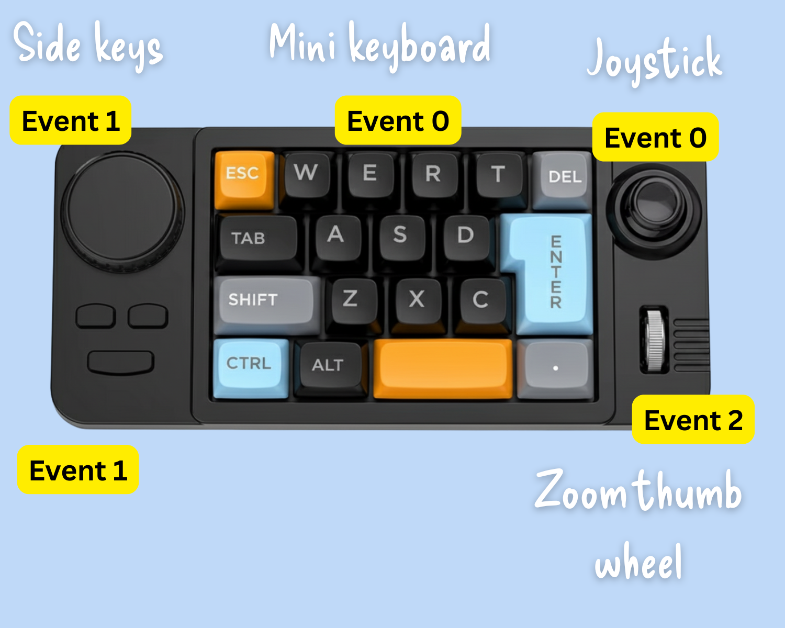

# K811 Macropad - EV Test Events (Ubuntu Linux)

The K811 is a hot-swappable mechanical keyboard sold [on Aliexpress](https://www.aliexpress.com/item/1005009262197889.html). As it has a joystick and a thumbwheel, it is ideal as a simple but effective PTZ controller (camera shortcuts can be mapped onto keys or side buttons). 

**Driver Download**: [K811 Driver (ZIP)](http://www.mkespnhk.com/upload/20250623104030.zip)  
**User Manual**: [K811 User Manual (PDF)](user-manual.pdf)

These are the button events as captured with `ev test` on Ubuntu 25.04 on September 7, 2025. 

## Input Areas

### Event Type Legend

- **EV_KEY**: Keyboard and button press events (type 1)
- **EV_REL**: Relative movement events like mouse wheel (type 2)
- **EV_MSC**: Miscellaneous events including scan codes (type 4)

### Notes

- Each key press generates both press (value 1) and release (value 0) events
- Mouse wheel events include both standard resolution (REL_WHEEL) and high resolution (REL_WHEEL_HI_RES) data
- Scan codes are hardware-specific identifiers for each key
- Key codes are Linux input subsystem standard codes (Ubuntu Linux)

## Main Keys

Event 0

## Joystick

Event 0

## Mouse Wheel

Event 2

## Side Controls 

Event 1

--- 

## Event Summary Table

| Event Device | Key/Control | Key Code | Scan Code | Event Type | Description |
|--------------|-------------|----------|-----------|------------|-------------|
| **event0** (Main Keys) | ESC | 1 | 70029 | EV_KEY | Escape key |
| event0 | W | 17 | 7001a | EV_KEY | Letter W |
| event0 | E | 18 | 70008 | EV_KEY | Letter E |
| event0 | R | 19 | 70015 | EV_KEY | Letter R |
| event0 | T | 20 | 70017 | EV_KEY | Letter T |
| event0 | DELETE | 111 | 7004c | EV_KEY | Delete key |
| event0 | TAB | 15 | 7002b | EV_KEY | Tab key |
| event0 | A | 30 | 70004 | EV_KEY | Letter A |
| event0 | S | 31 | 70016 | EV_KEY | Letter S |
| event0 | D | 32 | 70007 | EV_KEY | Letter D |
| event0 | ENTER | 28 | 70028 | EV_KEY | Enter/Return key |
| event0 | LEFT SHIFT | 42 | 700e1 | EV_KEY | Left Shift modifier |
| event0 | Z | 44 | 7001d | EV_KEY | Letter Z |
| event0 | X | 45 | 7001b | EV_KEY | Letter X |
| event0 | C | 46 | 70006 | EV_KEY | Letter C |
| event0 | LEFT CTRL | 29 | 700e0 | EV_KEY | Left Control modifier |
| event0 | LEFT ALT | 56 | 700e2 | EV_KEY | Left Alt modifier |
| event0 | SPACE | 57 | 7002c | EV_KEY | Spacebar |
| event0 | KEYPAD DOT | 83 | 70063 | EV_KEY | Numeric keypad dot/period |
| **event0** (Joystick) | RIGHT ARROW | 106 | 7004f | EV_KEY | Right arrow/directional key |
| event0 | LEFT ARROW | 105 | 70050 | EV_KEY | Left arrow/directional key |
| event0 | UP ARROW | 103 | 70052 | EV_KEY | Up arrow/directional key |
| event0 | DOWN ARROW | 108 | 70051 | EV_KEY | Down arrow/directional key |
| **event1** (Side Keys) | VOLUME UP | 115 | c00e9 | EV_KEY | Volume increase button |
| event1 | VOLUME DOWN | 114 | c00ea | EV_KEY | Volume decrease button |
| event1 | PREVIOUS SONG | 165 | c00b6 | EV_KEY | Media previous track |
| event1 | NEXT SONG | 163 | c00b5 | EV_KEY | Media next track |
| event1 | PLAY/PAUSE | 164 | c00cd | EV_KEY | Media play/pause toggle |
| **event2** (Mouse Wheel) | WHEEL UP | - | - | EV_REL | Mouse wheel scroll up (REL_WHEEL value: 1) |
| event2 | WHEEL DOWN | - | - | EV_REL | Mouse wheel scroll down (REL_WHEEL value: -1) |